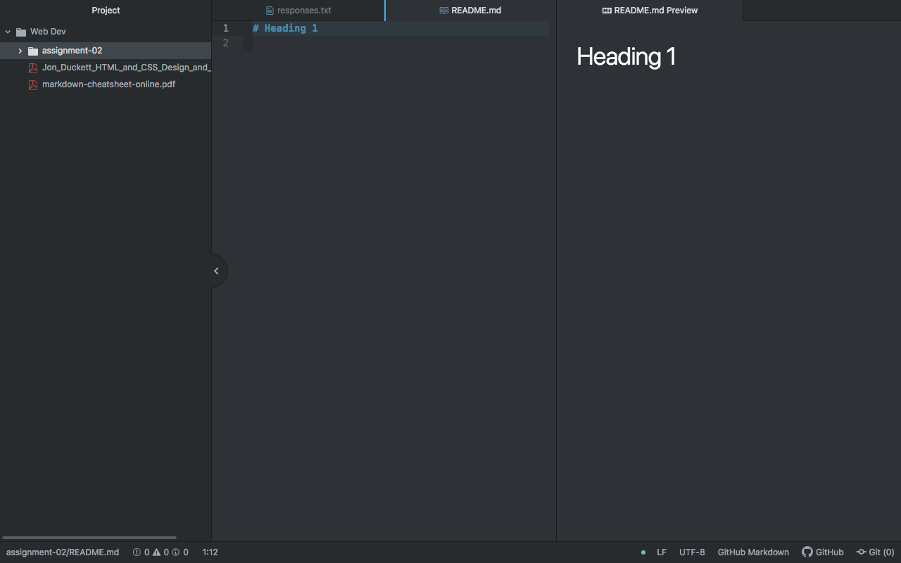

# Assignment 2
## Landon Hansen

I decided to take this class at the very last minute. My entire schedule had to be reworked three days before the semester began, and I had to act quickly in order to rebuild my entire semester. This is my final semester at the University and I decided that given the circumstances finishing out the remaining 9 credits would best be done online. I chose this class becuase I am interested in the material, and I needed something which I could do without living in Missoula. I'd say I am content with how things turned out considering this wasn't at all my intention.

* I am excited to learn how to actually write in code.
* I hope to learn how to use computers to make my life better.
* I have learned some of the more technical aspects of how communication works between computers, I didn't know the DNS process, and I think learning these technical elements makes the logic behind the coding more apparent to myself.

[Manchester United](https://www.manutd.com)

[My Responses](./responses.txt)

