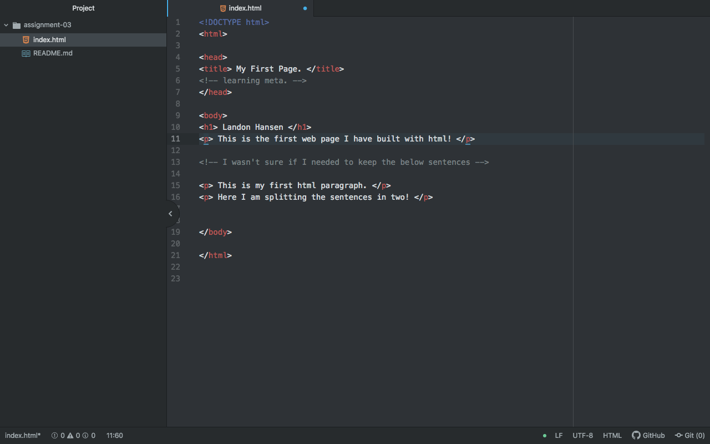

# Assignment 3
## Landon Hansen

Web browsers are essentially compilers of information, they gather the different elements included in a web sites files and primarily read its html, css, and style/media files to put them all together to make the website that people can interact with. I primarily use Safari as I have a mac and it works okay for just surfing the web, Firefox because the UofM suggests it for Moodle and so it is basically my school browser, and Opera Developer every once in a great while to see if its VPN service is up and running yet... which it never is.

A markup language is a language that directs a computer program to display the information in the correct way, it does this via tags (for instance 

). The most common one we will discuss in class is HTML, it is the most common and foundational web development language and most of the websites I use are either written in HTML or in PhP (Which is what I believe Facebook uses).

