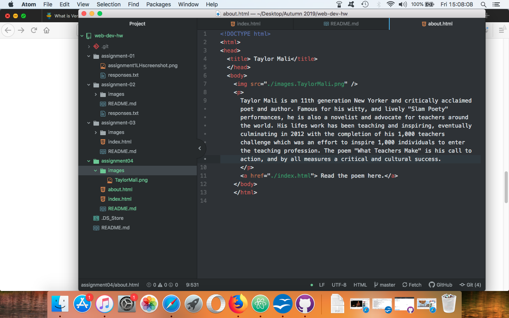

# Homework 04
##Landon Hansen

I decided to go to a couple different sites just to see what it was like. I went to Myspace and Manchester United's sites. Myspace obvious is nothing like it was, and I knew that going in, I was surprised how similar it was, basically the only major change was a reshuffle of the links in order to make the pictures much bigger. The best part of the new design for the United website is that they used to have a splash page and that is no longer there, I didn't see that on the old version but I remember it being very annoying.

This was a fun lesson, I like that we are moving into the html language and can see out live sites. That is very interesting to experience. I felt like it was all very clear, and I think through the repetition all of it will become (hopefully) second nature.

